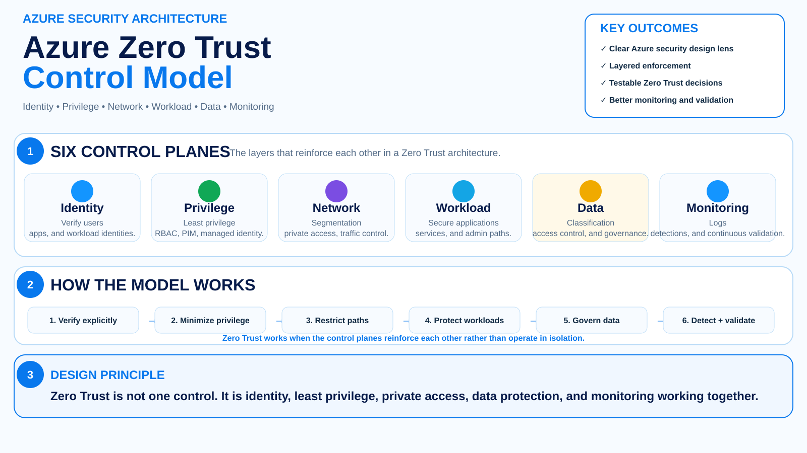

# Azure Zero Trust Reference Architectures

> **Zero Trust is not a product. It is an architecture strategy built around three principles: verify explicitly, use least privilege, and assume breach.**

A practical collection of Microsoft Azure reference architectures for applying Zero Trust across identity, applications, landing zones, privileged access, networking, data, monitoring, and security operations.

This repository focuses on a simple question:

> **What does Zero Trust actually look like when you have to design, deploy, validate, and monitor it in Azure?**

The goal is to move beyond diagrams and slogans into repeatable architecture patterns, implementation decisions, controls, validation steps, and detection ideas.

## Architecture decisions and business value

Use the [reusable architecture decision framework](docs/decision-framework/architecture-decision-framework/README.md), [ADR template](docs/decision-framework/architecture-decision-framework/ADR-template.md), and [business-case template](docs/decision-framework/architecture-decision-framework/business-case-template.md). The [Zero Trust decision examples](docs/decision-framework/zero-trust-architecture-decisions.md) compare private connectivity, managed identity, and approval-gated response with explicit trade-offs, costs, and acceptance gates.

## What this demonstrates

- Zero Trust architecture across identity, privilege, networking, workloads, data, and monitoring;
- Terraform implementation with Managed Identity, Private Link, Key Vault, Storage, and Log Analytics;
- negative-security testing that proves controls fail safely;
- Microsoft Sentinel KQL and scheduled analytics rules;
- automation rules, Logic Apps playbooks, and approval-gated remediation;
- end-to-end validation from architecture through detection and response.



---

## Validation status and evidence

**Azure live end-to-end testing: not yet performed or published.** The current [validation-evidence register](docs/validation/evidence/README.md) lists required proof, unresolved safety issues, and an [evidence report template](docs/validation/evidence/template.md). Static checks and authored playbooks are not presented as live remediation success.

## Engineering proof and review path

**Problem → Architecture → Trust boundaries → Threats → Controls → Deployment → Validation → Monitoring**

| Review question | Evidence |
|---|---|
| What is the reference architecture? | [Enterprise application](architecture/enterprise-application/README.md) |
| What security decisions were made? | [Architecture decisions](docs/architecture-decisions.md) and [control matrix](docs/control-matrix.md) |
| What is deployable? | [Terraform implementation](terraform/enterprise-application/README.md) |
| How are denied paths tested? | [Negative-security tests](tests/enterprise-application/README.md) |
| How is control drift detected/responded to? | [Sentinel KQL and SOAR](https://github.com/mhartson310/Sentinel-KQL-Library/tree/main/kql-queries/zero-trust/enterprise-application) |
| How is end-to-end validation planned? | [Azure validation runbook](docs/validation/zero-trust-end-to-end-runbook.md) |

**Validation boundary:** An authored runbook and passing static CI are not proof that destructive remediation was exercised successfully in Azure. Record live evidence before claiming operational validation.

## Zero Trust principles

| Principle | Azure interpretation |
|---|---|
| **Verify explicitly** | Authenticate and authorize every request using identity, device, workload, location, risk, and other available signals. |
| **Use least privilege** | Minimize standing access with RBAC, PIM, JIT/JEA, managed identities, scoped permissions, and data protection. |
| **Assume breach** | Segment access, reduce blast radius, encrypt traffic, monitor continuously, detect suspicious behavior, and design for recovery. |

These principles are based on Microsoft's Zero Trust guidance for Azure.

---

## Architecture portfolio

### 1. Zero Trust Enterprise Application on Azure

**Status: Architecture + Terraform + Sentinel detection pack available**

A practical workload architecture showing how identity, authorization, network isolation, workload identity, data protection, and monitoring work together.

```text
Users / Apps
     ↓
Microsoft Entra ID
     ↓
Conditional Access + MFA + Risk
     ↓
Application / API
     ↓
Managed Identity
     ↓
Private Link / Private Endpoints
     ↓
Azure Data Services
     ↓
Azure Monitor + Defender + Sentinel
```

**Key controls**

- Microsoft Entra ID
- Conditional Access
- MFA / phishing-resistant authentication where appropriate
- RBAC and PIM
- Managed Identity
- Key Vault
- Private Link
- Azure Firewall / NSGs where required
- Defender for Cloud
- Microsoft Purview
- Azure Policy
- Azure Monitor
- Microsoft Sentinel

[Explore the architecture →](architecture/enterprise-application/README.md) · [Terraform implementation →](terraform/enterprise-application/README.md) · [Sentinel detections →](sentinel/enterprise-application/README.md) · [Negative-security tests →](tests/enterprise-application/README.md) · [Sentinel KQL Library — Zero Trust detection pack →](https://github.com/mhartson310/Sentinel-KQL-Library/tree/main/kql-queries/zero-trust/enterprise-application) · [Deployable Sentinel rules →](https://github.com/mhartson310/Sentinel-KQL-Library/tree/main/deploy/bicep/zero-trust-analytics) · [Automated response →](https://github.com/mhartson310/Sentinel-KQL-Library/tree/main/deploy/playbooks/zero-trust) · [Conditional remediation →](https://github.com/mhartson310/Sentinel-KQL-Library/tree/main/deploy/playbooks/zero-trust/conditional-remediation)

---

### 2. Zero Trust Azure Landing Zone

**Status: Foundation available**

A security overlay for enterprise Azure landing zones that treats platform governance, management groups, network boundaries, identity, logging, and policy as part of the Zero Trust control plane.

**Focus areas**

- management-group hierarchy
- subscription isolation
- platform vs workload ownership
- hub-spoke or Virtual WAN segmentation
- centralized inspection
- Private Link / private DNS
- Azure Policy guardrails
- Defender for Cloud
- centralized Log Analytics / Sentinel
- privileged platform administration

[Explore the architecture →](architecture/landing-zone/README.md)

---

### 3. Zero Trust Privileged Access

**Status: Foundation available**

A reference pattern for reducing standing administrative privilege and constraining where, when, and how privileged operations can occur.

**Focus areas**

- Entra ID privileged roles
- Privileged Identity Management (PIM)
- Conditional Access
- phishing-resistant MFA
- privileged access devices / hardened admin paths
- JIT / JEA
- break-glass accounts
- privileged activity monitoring
- Microsoft Sentinel detections

[Explore the architecture →](architecture/privileged-access/README.md)

---

## Repository structure

```text
Azure-Zero-Trust-Reference-Architectures/
├── README.md
├── architecture/
│   ├── enterprise-application/
│   │   └── README.md
│   ├── landing-zone/
│   │   └── README.md
│   └── privileged-access/
│       └── README.md
├── docs/
│   ├── zero-trust-principles.md
│   ├── control-matrix.md
│   ├── architecture-decisions.md
│   └── validation-checklist.md
├── bicep/
├── terraform/
├── policy/
├── sentinel/
│   └── README.md
└── tests/
```

---

## Zero Trust control model

This repository uses a consistent architecture pattern:

**Problem → Trust boundaries → Controls → Implementation → Validation → Monitoring**

Every reference architecture should answer:

1. **What are we protecting?**
2. **Who or what is requesting access?**
3. **What signals establish trust?**
4. **Where is authorization enforced?**
5. **How is privilege minimized?**
6. **How is blast radius reduced?**
7. **What telemetry proves the controls are working?**
8. **How do we test failure paths?**

---

## Cross-cutting control matrix

| Security objective | Primary Azure capabilities |
|---|---|
| Identity assurance | Microsoft Entra ID, Conditional Access, MFA, Identity Protection |
| Least privilege | RBAC, PIM, Managed Identity, JIT/JEA |
| Workload identity | Managed Identity, workload identity federation |
| Network segmentation | VNets, NSGs, Azure Firewall, Virtual WAN |
| Private service access | Private Link, private endpoints, private DNS |
| Secrets and keys | Azure Key Vault, Managed HSM |
| Data governance | Microsoft Purview |
| Security posture | Microsoft Defender for Cloud |
| Platform guardrails | Azure Policy, management groups |
| Monitoring | Azure Monitor, Log Analytics |
| Detection and response | Microsoft Sentinel, Defender XDR |
| Resilience | Backup, recovery, resource locks, immutable controls where appropriate |

See the full [Zero Trust control matrix](docs/control-matrix.md).

---

## Validation over assumptions

A Zero Trust architecture should be tested through **negative validation**, not just happy-path deployment.

Examples:

- Can a user bypass Conditional Access from an unmanaged device?
- Can a workload authenticate without a stored secret?
- Can one workload directly reach another workload that should be isolated?
- Can an application access a service through its public endpoint?
- Can a non-privileged identity activate or inherit privileged access?
- Can an administrator perform sensitive actions outside the approved path?
- Are denied requests and privilege changes visible in monitoring?
- Can suspicious behavior be correlated into an investigation?

See the [validation checklist](docs/validation-checklist.md).

---

## Architecture decision records

Zero Trust is not a checklist. Many controls require tradeoffs.

This repository documents decisions such as:

- hub-spoke vs Virtual WAN
- service endpoints vs Private Link
- system-assigned vs user-assigned managed identity
- platform-managed vs workload-managed networking
- standing RBAC vs PIM-eligible access
- centralized vs workload-level inspection
- shared vs dedicated Log Analytics workspaces
- policy enforcement vs audit-first rollout

See [architecture decisions](docs/architecture-decisions.md).

---

## Monitoring and detection

A Zero Trust architecture should produce security telemetry that answers:

**Who requested access? What was authorized? What changed? What was denied? What happened next?**

The monitoring layer will include:

- Entra ID sign-in and audit events
- Conditional Access outcomes
- PIM activations and role changes
- Azure Activity Logs
- Defender for Cloud findings
- network and firewall telemetry
- Key Vault activity
- workload/application events
- Microsoft Sentinel hunting and detections

[Explore the Sentinel integration plan →](sentinel/README.md)

---

## Relationship to my other repositories

This repository is intended to connect the broader Azure security portfolio:

- **[Azure-Landing-Zones](https://github.com/mhartson310/Azure-Landing-Zones)** — enterprise platform and infrastructure foundation
- **[Azure-Secure-Enterprise-RAG](https://github.com/mhartson310/Azure-Secure-Enterprise-RAG)** — secure AI workload architecture
- **[Sentinel-KQL-Library](https://github.com/mhartson310/Sentinel-KQL-Library)** — detection engineering and operational security
- **[FedRAMP-Azure-Toolkit](https://github.com/mhartson310/FedRAMP-Azure-Toolkit)** — regulated-cloud governance and compliance automation
- **[Azure-Cost-Optimization-Toolkit](https://github.com/mhartson310/Azure-Cost-Optimization-Toolkit)** — cost governance and optimization

Together, the portfolio covers:

**Identity → Platform → Workloads → Data & AI → Detection → Governance**

---

## Roadmap

### Phase 1 — Architecture foundation
- [x] Zero Trust principles
- [x] Enterprise application pattern
- [x] Landing-zone security pattern
- [x] Privileged-access pattern
- [x] Cross-cutting control matrix
- [x] Validation framework
- [x] Architecture decision framework

### Phase 2 — Visual reference architectures
- [ ] Enterprise application architecture graphic
- [ ] Zero Trust landing-zone architecture graphic
- [ ] Privileged-access architecture graphic
- [ ] Portfolio-level Zero Trust control-plane graphic

### Phase 3 — Implementation
- [ ] Bicep examples
- [x] Terraform enterprise-application example
- [ ] Azure Policy examples
- [ ] Conditional Access examples
- [ ] PIM / RBAC patterns
- [ ] Private Link patterns

### Phase 4 — Detection and validation
- [x] Sentinel enterprise-application hunting queries
- [ ] Sentinel analytics rules
- [ ] validation scripts
- [ ] negative test cases
- [ ] CI checks

### Phase 5 — Additional reference architectures
- [ ] AKS Zero Trust
- [ ] Azure Data Zero Trust
- [ ] AI Agent Zero Trust
- [ ] DevOps / CI-CD Zero Trust

---

## References

- [Zero Trust security in Azure](https://learn.microsoft.com/azure/security/fundamentals/zero-trust)
- [Zero Trust for Azure infrastructure](https://learn.microsoft.com/security/zero-trust/azure-infrastructure-overview)
- [Zero Trust for Azure networking](https://learn.microsoft.com/security/zero-trust/azure-networking-overview)
- [Privileged access architecture](https://learn.microsoft.com/security/zero-trust/adopt/implement-privileged-access)
- [Zero Trust and Microsoft Defender for Cloud](https://learn.microsoft.com/azure/defender-for-cloud/zero-trust)

---

## Author

**Mario Worwell**  
Cloud Security Architect | Azure | Zero Trust | AI Security | SIEM/XDR

Practical reference architectures, security patterns, detection engineering, and governance guidance for modern Azure environments.


## End-to-end validation

Use the **[Zero Trust end-to-end validation runbook](docs/validation/zero-trust-end-to-end-runbook.md)** to prove the full lab path:

**Terraform → negative tests → Sentinel detections → automation → approval-gated remediation → post-remediation validation**
