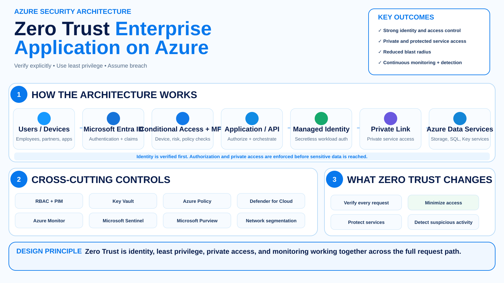
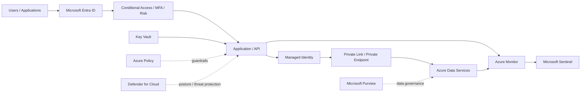

# Zero Trust Enterprise Application on Azure

This reference architecture applies Zero Trust principles to a common enterprise application workload.

## Architecture

## Trust boundaries

1. **Caller → Entra ID** — establish identity.
2. **Entra ID → application** — evaluate Conditional Access and authorization context.
3. **Application → Azure service** — use workload identity instead of embedded credentials.
4. **Network → data plane** — restrict service exposure with private connectivity where required.
5. **Application → data** — enforce data authorization independent of network location.
6. **Workload → monitoring** — produce enough telemetry to validate the control path.

## Zero Trust mapping

### Verify explicitly

- Entra authentication
- Conditional Access
- MFA / phishing-resistant authentication where appropriate
- device/risk signals
- workload identity
- per-request application authorization

### Use least privilege

- scoped RBAC
- managed identities
- separate runtime/admin identities
- PIM for administration
- Key Vault access policies/RBAC
- data-level permissions

### Assume breach

- segmented workload network
- private endpoints
- deny unnecessary traffic
- Defender for Cloud
- central logging
- Sentinel detections
- protected recovery paths

## Failure paths to test

- stolen user token
- unmanaged device
- compromised application identity
- overly broad managed identity role
- public endpoint bypass
- lateral movement to another workload
- Key Vault secret enumeration
- policy exemption abuse
- disabled diagnostic settings

## Next implementation work

- Bicep deployment
- Terraform deployment
- Azure Policy baseline
- Conditional Access examples
- Sentinel detections
- negative test harness

## Implementation

The first deployable implementation for this pattern is now available:

- **[Terraform](../../terraform/enterprise-application/README.md)** — App Service, Managed Identity, private endpoints, Key Vault, Storage, Private DNS, Log Analytics, and diagnostics.
- **[Sentinel detection pack](../../sentinel/enterprise-application/README.md)** — KQL for public exposure changes, privileged RBAC assignments, diagnostic-setting changes, Key Vault anomalies, and Conditional Access failures.

The implementation deliberately keeps tenant-wide Conditional Access and PIM configuration outside the workload deployment. Those controls should be governed centrally and rolled out with appropriate emergency-access and exclusion design.

## Negative-security validation

The architecture now includes executable tests that prove the expected failure paths:

- public endpoints remain disabled;
- private endpoint connections are approved;
- the workload identity has narrow read/secret permissions only;
- diagnostic settings remain connected to Log Analytics;
- protected service names resolve privately;
- the managed identity can read approved test data;
- an unauthorized Blob write is denied.

See **[Negative-Security Validation](../../tests/enterprise-application/README.md)**.
