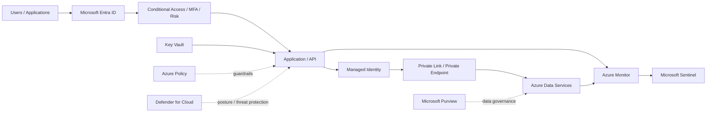

# Zero Trust Enterprise Application on Azure

This reference architecture applies Zero Trust principles to a common enterprise application workload.

## Architecture

## Trust boundaries

1. **Caller → Entra ID** — establish identity.
2. **Entra ID → application** — evaluate Conditional Access and authorization context.
3. **Application → Azure service** — use workload identity instead of embedded credentials.
4. **Network → data plane** — restrict service exposure with private connectivity where required.
5. **Application → data** — enforce data authorization independent of network location.
6. **Workload → monitoring** — produce enough telemetry to validate the control path.

## Zero Trust mapping

### Verify explicitly

- Entra authentication
- Conditional Access
- MFA / phishing-resistant authentication where appropriate
- device/risk signals
- workload identity
- per-request application authorization

### Use least privilege

- scoped RBAC
- managed identities
- separate runtime/admin identities
- PIM for administration
- Key Vault access policies/RBAC
- data-level permissions

### Assume breach

- segmented workload network
- private endpoints
- deny unnecessary traffic
- Defender for Cloud
- central logging
- Sentinel detections
- protected recovery paths

## Failure paths to test

- stolen user token
- unmanaged device
- compromised application identity
- overly broad managed identity role
- public endpoint bypass
- lateral movement to another workload
- Key Vault secret enumeration
- policy exemption abuse
- disabled diagnostic settings

## Next implementation work

- Bicep deployment
- Terraform deployment
- Azure Policy baseline
- Conditional Access examples
- Sentinel detections
- negative test harness
