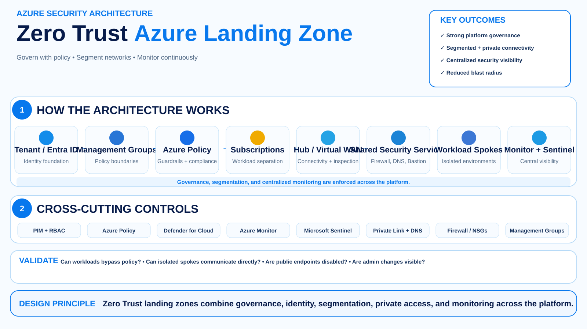

# Zero Trust Azure Landing Zone

A landing zone is not Zero Trust simply because it has a hub VNet and Azure Policy.



This architecture applies Zero Trust across the Azure platform control plane.

## Control-plane model

```text
Tenant / Entra ID
      ↓
Management Groups
      ↓
Platform Guardrails (Azure Policy)
      ↓
Subscriptions
      ↓
Hub / Virtual WAN
      ↓
Shared Security Services
      ↓
Workload Spokes / Subscriptions
      ↓
Central Monitoring + Sentinel
```

## Design objectives

### Identity

- restrict tenant/subscription administration;
- use PIM for privileged roles;
- separate platform and workload administration;
- protect break-glass identities.

### Governance

- management groups aligned to policy boundaries;
- policy-as-code;
- approved regions/SKUs where required;
- mandatory diagnostics;
- public-access restrictions;
- tagging/ownership standards.

### Network

- separate platform and workloads;
- inspect required transit paths;
- control spoke-to-spoke communication;
- prefer private service connectivity where required;
- centralize private DNS deliberately.

### Security operations

- Defender for Cloud across subscriptions;
- Azure Activity Logs centralized;
- Log Analytics / Sentinel integration;
- detections for policy, RBAC, network, and security-control changes.

## Relationship to Azure-Landing-Zones

The existing [Azure-Landing-Zones](https://github.com/mhartson310/Azure-Landing-Zones) repository provides infrastructure patterns.

This Zero Trust architecture adds the **security decision model, validation requirements, and monitoring layer** around the platform.
