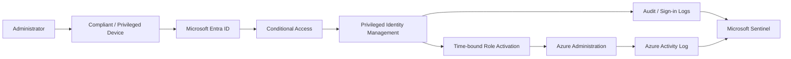

# Zero Trust Privileged Access

Privileged access is one of the highest-impact trust boundaries in Azure.

The design goal is not simply stronger MFA.

It is to reduce **who can become privileged, when they can become privileged, where they can administer from, what they can do, and how quickly suspicious privilege can be detected.**

## Reference flow

## Core controls

- separate privileged identities where appropriate;
- phishing-resistant authentication for high-risk admin workflows;
- PIM-eligible roles;
- approval and justification for sensitive roles;
- time-bound activation;
- compliant/hardened administrative devices;
- restricted administrative interfaces;
- protected break-glass accounts;
- alerting for unusual activation, permanent assignment, and policy weakening.

## High-value validation tests

- can a normal user identity activate a privileged role?
- can an administrator elevate from an unmanaged device?
- can privileged access persist after the activation window?
- can a privileged role be made permanent without detection?
- can Conditional Access for admins be disabled silently?
- is break-glass use immediately visible?
- can service principals receive high-privilege application roles without detection?

## Detection priorities

- privileged role assigned outside change window;
- unusual PIM activation;
- permanent role assignment;
- Conditional Access weakened/disabled;
- break-glass account activity;
- app-role grants to service principals;
- new federated trust / identity provider changes.
